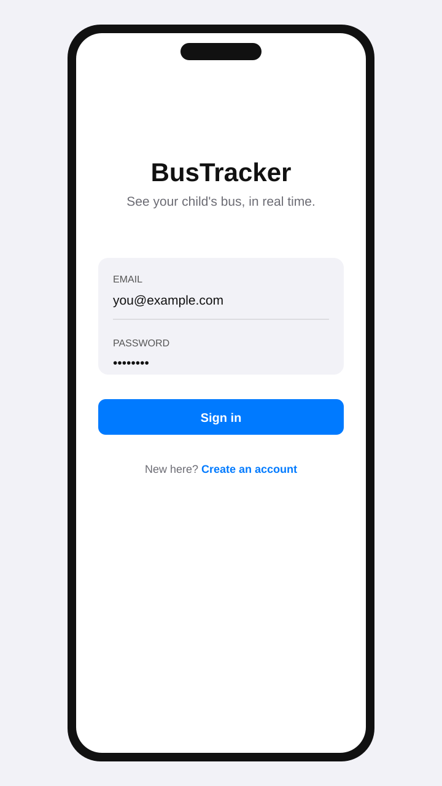
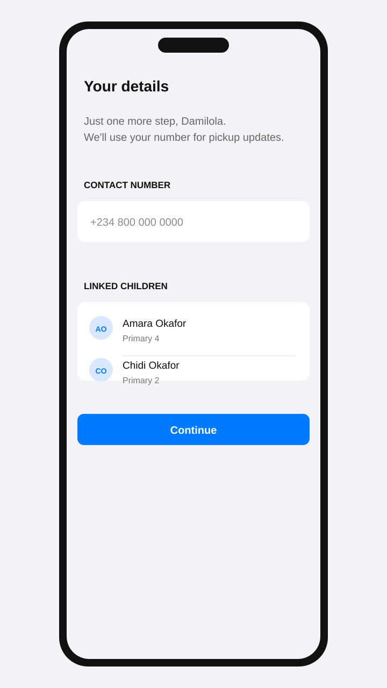
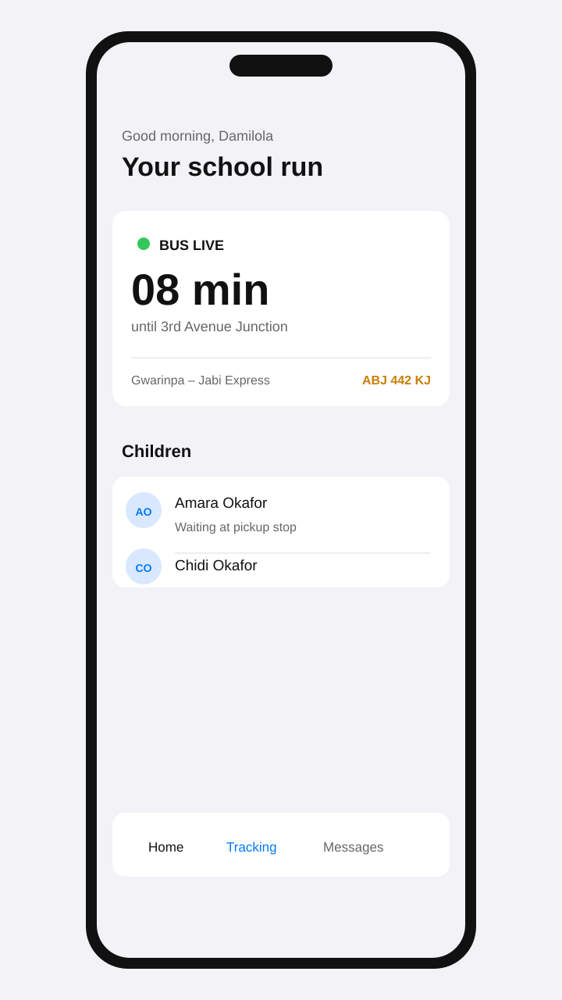
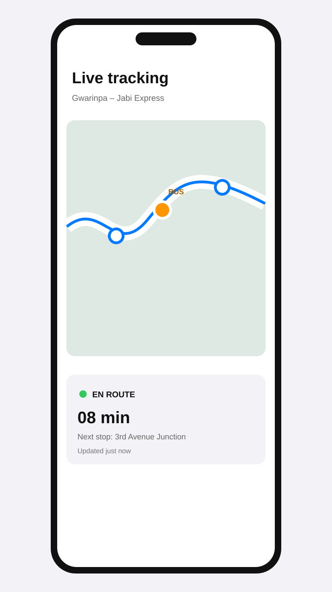
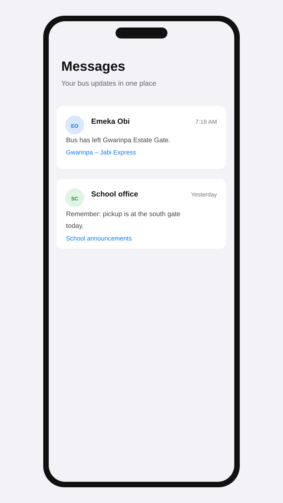

# BusTracker

BusTracker is a React Native and Expo app for giving parents a calmer, clearer view of the school run. It is designed around one question: **where is the bus, and what does that mean for my child?**

The experience combines account setup, linked children, live route progress, pickup and drop-off context, and messages from the driver or school. The project currently uses local mock data and a simulated bus position so the product flow can be developed before a production backend is connected.

## Product Preview

The repository includes five local product mockups. They illustrate the intended parent journey and are not runtime screenshots.

<p align="center">
	
	
	
	
	
</p>

| Screen | What it communicates |
| --- | --- |
| Sign in | A focused entry point for returning parents, with email and password authentication. |
| Profile setup | A short first-run step for contact details and linked children. |
| Home | At-a-glance ETA, route, bus identity, and the current state of each child. |
| Live tracking | The bus position, route progress, next stop, and freshness of the update. |
| Messages | Driver and school updates organized around the family’s bus route. |

## Core Flows

- **Authentication:** Sign in or create an account with name, email, and password.
- **Profile completion:** New accounts add a phone number before entering the main app.
- **Child context:** A parent can see linked children, their grade, bus, and pickup stop.
- **Live route tracking:** A shared bus-position subscription reports status, coordinates, heading, speed, next stop, ETA, and update time.
- **Trip history:** Mock trip records preserve pickup and drop-off runs and the stops visited on each trip.
- **Communication:** Messages carry sender role, route, body, and timestamp so a production inbox can be added without changing the screen-facing shapes.
- **Safety surfaces:** Attendance, emergency contacts, notifications, preferences, feedback, and detail views are defined as protected navigation destinations in the root navigator.

## Tech Stack

- [Expo](https://expo.dev/) SDK 57 with Expo Router
- React 19 and React Native 0.86
- TypeScript in strict mode
- `react-native-maps` for the tracking surface
- `expo-location` for location permission and pickup context
- `expo-blur`, `expo-haptics`, and `expo-symbols` for native-feeling interaction details
- Shared design tokens in `src/theme.ts` using platform system colors

## Getting Started

### Requirements

- Node.js 20 or newer
- npm
- Expo Go, an Android emulator, or an iOS simulator
- Android Maps API key when building the Android map experience

### Install and run

```bash
npm install
npm start
```

Then choose a target from the Expo CLI, or use one of the package scripts:

```bash
npm run android
npm run ios
npm run web
```

The app is configured for portrait orientation. On Android, replace `REPLACE_WITH_ANDROID_MAPS_API_KEY` in `app.json` before using Google Maps in a device build.

## Demo Data

The mock route runs from **Gwarinpa Estate Gate** to **Jabi Motor Park** through five stops:

1. Gwarinpa Estate Gate
2. 3rd Avenue Junction
3. Life Camp Roundabout
4. Jabi Lake Mall
5. Jabi Motor Park

The sample family includes Amara Okafor and Chidi Okafor, both assigned to bus `ABJ 442 KJ` and the 3rd Avenue Junction stop. The route, bus, student, attendance, trip, message, and emergency-contact shapes live in `src/data/mock.ts`.

## How Live Tracking Works

`src/services/tracking.ts` is the single boundary for bus location updates. It currently simulates movement between stops:

- 4 seconds of pre-departure waiting
- 32 seconds of simulated travel per route leg
- 6 seconds of dwell time at each intermediate stop
- one shared timer for multiple subscribers watching the same bus

Screens subscribe through `useBusPosition` rather than calculating coordinates themselves. Replacing the simulator with a websocket, polling client, or realtime database should therefore stay contained inside the tracking service.

## Project Structure

```text
app/                  Expo Router layouts and route screens
(auth)/               Login and account creation
(tabs)/               Home, tracking, messages, and more navigation
profile-setup.tsx     First-run parent contact setup
src/components/        Reusable screen, card, field, row, button, and display primitives
src/data/mock.ts       Typed route, bus, child, trip, attendance, and message data
src/hooks/             React hooks for live bus subscriptions
src/services/          Session and tracking boundaries
src/theme.ts           Platform colors, spacing, radii, layout, and typography
src/utils/             Small formatting helpers
docs/mockups/          Local SVG product mockups used by this README
```

## Design Direction

BusTracker follows a restrained, native system UI language:

- iOS-style typography and spacing with Dynamic Type-friendly text styles
- System blue reserved for interaction and links
- Orange used for the bus and route identity
- Green reserved for live or active status
- Red reserved for emergency and alert states
- Reusable primitives keep screens consistent without hiding the underlying flow

## Current Scope

This is a product foundation rather than a production-connected transport platform. Authentication, location, and tracking are currently stubbed or simulated. A next backend integration would need durable auth, parent/child authorization, a live bus position feed, school and driver roles, push notifications, and persisted attendance and trip records.

## License

See [LICENSE](LICENSE).
